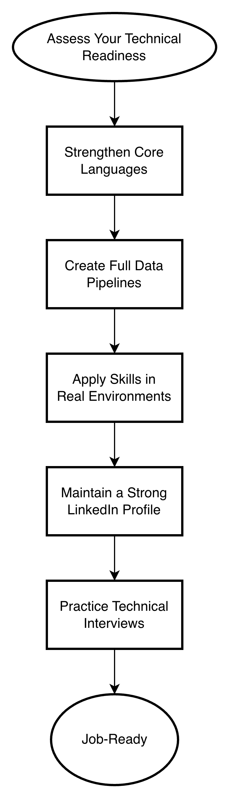

# Preparing to become a Data Scientist: A Process Roadmap for Husky Students

© Image from Cornell Bowers

---

**Prepared for:** Husky student pursuing a job as a Data Scientist  
**Prepared by:** Lasya Venna  
**Date:** January 23, 2026

---

## Table of Contents 
- [Purpose](#purpose) 
- [Figure 1: Preparation Roadmap](#figure-1-preparation-roadmap) 
- [Building Your Technical Foundation](#building-your-technical-foundation) 
    - [Assessing Your Technical Readiness](#assessing-your-technical-readiness) 
    - [Strengthening Core Languages](#strengthening-core-languages) 
    - [Creating Full Data Pipelines](#creating-full-data-pipelines) 
- [Developing Professional Experience](#developing-professional-experience) 
    - [Applying Skills in Real Environments](#applying-skills-in-real-environments) 
    - [Maintaining a Strong LinkedIn Profile](#maintaining-a-strong-linkedin-profile) 
- [Preparing for the Hiring Process](#preparing-for-the-hiring-process) 
    - [Practicing Technical Interviews](#practicing-technical-interviews) 
- [Conclusion](#conclusion) 
- [References](#references)

---

## Purpose

The purpose of this document is to guide you through the concrete steps, skills, and actions that increase your readiness for a Data Scientist role. This process explains what actions you take beyond required coursework, including strengthening your technical foundations, building your portfolio, gaining experience, and preparing for the hiring process. The goal is to give you a clear, actionable roadmap that shows what you do, why each step matters, and how each action contributes to you becoming job‑ready.

---

## Figure 1: Preparation Roadmap

© Image from Lasya Venna

This figure summarizes the full preparation process for becoming a Data Scientist. The flowchart walks through the entire Best Practices section with a single visual so you can understand the overall flow before reading the detailed steps.

---

# Building Your Technical Foundation

## Assessing Your Technical Readiness

A good starting point is understanding what employers actually expect from Data Scientist candidates. Looking through job descriptions helps you see which skills show up repeatedly, usually Python, SQL, statistics, and machine learning. When you compare these expectations to your current abilities, you get a clearer sense of where you’re already strong and where you might want to focus your learning. 

This step also keeps you from wasting time on skills that are irrelevant. For example, if you notice that most roles emphasize SQL but rarely mention R, you can prioritize accordingly. Over time, checking job descriptions every few months helps you stay aligned with industry trends and gives you a sense of how your skills are growing. 

---

## Strengthening Core Languages

Once you know what skills matter most, the next step is building a strong foundation in the core languages used in data science. Python and SQL are essential for almost every part of the workflow: from cleaning data to building models. Becoming comfortable with them makes everything else easier.

Practicing regularly is key. Working through coding challenges, experimenting with libraries like pandas or scikit‑learn, and building small scripts all help you get more comfortable with the tools you’ll use on the job. These habits also prepare you for technical interviews, where you’ll often be asked to write queries or solve coding problems on the spot. 

---

## Creating Full Data Pipelines

Building end‑to‑end projects is one of the best ways to show that you can apply your skills to real problems. These projects usually involve collecting data, cleaning it, analyzing it, building models, and visualizing your results. Working through each stage helps you understand how data flows through a system and how your decisions affect the final outcome. 

These projects also help you develop your problem‑solving skills. Employers want candidates who can take a messy, open‑ended problem and turn it into a structured solution. When you build projects that reflect real‑world challenges like predicting trends or analyzing customer behavior, you show that you can think like a Data Scientist. 

---

# Developing Professional Experience 

## Applying Skills in Real Environments

Hands‑on experience is one of the most valuable parts of your preparation. Internships, research roles, volunteer analytics work, and campus projects all give you opportunities to apply your skills in real situations. These experiences help you learn how to collaborate, communicate, and adapt.

If you can’t get an internship right away, don’t worry. There are plenty of other ways to build experience. Joining student clubs, contributing to open‑source projects, or helping professors with research can all help you grow your skills and show initiative. These experiences also help you build a network. Connecting with peers, mentors, and professionals can lead to future opportunities and give you insight into what different data roles look like in practice.

---

## Maintaining a Strong LinkedIn Profile

Your online presence plays a big role in how employers see you. Keeping your LinkedIn profile updated with your projects, skills, and accomplishments helps you present yourself as someone who’s active and engaged in the field. Recruiters often use LinkedIn to find candidates, so a strong profile increases your chances of being noticed. 

Engaging with the data science community can also help you grow. Sharing your projects, commenting on posts, and connecting with professionals shows that you’re curious and involved. These interactions can lead to new opportunities and help you stay informed about industry trends. 

---

# Preparing for the Hiring Process

## Practicing Technical Interviews

Technical interviews can feel intimidating at first, but practicing regularly makes a big difference. Working through SQL problems, Python challenges, and machine‑learning questions helps you get comfortable with the types of tasks you’ll see during interviews. Over time, you’ll get better at explaining your thought process and solving problems under pressure. 

Interviews also test your understanding of core concepts. You might be asked about model evaluation, feature engineering, or data preprocessing, so reviewing these topics helps you feel more prepared. Practicing with friends, mentors, or online platforms can help you build confidence and improve your communication skills. These skills will help you not only during interviews but throughout your career.

---

# Conclusion
If you follow these steps consistently, you build a strong foundation that prepares you for both internships and full‑time Data Scientist roles. If you identify your gaps early, then you can focus your learning efficiently. If you create and document meaningful projects, then you show employers exactly what you can do. If you strengthen your professional presence and practice interviews, then you position yourself as a competitive, well‑prepared candidate. This process gives you a clear path forward and helps you take control of your career development.

---

# References
[1] “Data Scientist Job Description | Indeed,” Indeed.com, 2023. https://uk.indeed.com/hire/job-description/data-scientist.  
[2] U.S. Bureau of Labor Statistics, “Data Scientists,” www.bls.gov, Aug. 29, 2024. https://www.bls.gov/ooh/math/data-scientists.htm.  
[3] “Career Services,” Career Services, Aug. 08, 2024. https://www.uwb.edu/career-services/resources/interviews/technical-interviews (accessed Jan. 23, 2026).  
[4] Jacobsen, Zaylan. Personal interview, 15 Jan., 2025.